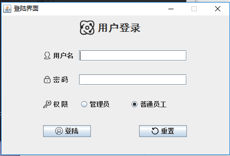

# 目录结构

|-wg-client-simple，客户端主体

|-wg-server-simple，更新服务器，用于保存新版本软件

|-wg-update-simple，更新程序，用于更新客户端

|-example 项目案例，打包后的jar包命名格式必须和里面的相同

客户端jar包命名：wg-client-simple.jar

更新程序jar包命名：wg-update-simple.jar

# 主要界面设计：

## 1.登陆界面

## 2.主页

## 3.登录用户信息修改

## 4. 用户管理

## 5. 员工添加

## 6. 物料管理

## 7. 物料档案添加

## 8.进出仓管理

## 9. 添加进仓记录

## 10. 添加出仓记录

## 11.报表管理

## 12 报表打印

